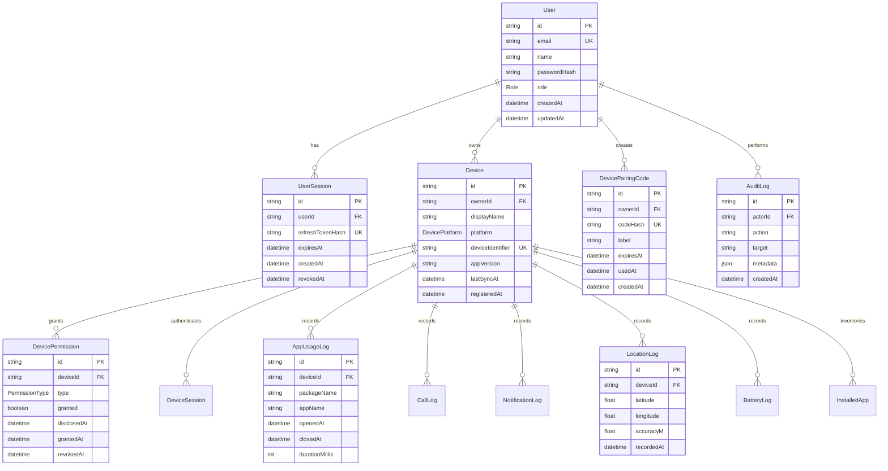

# ER Diagram

```mermaid
erDiagram
  User ||--o{ UserSession : has
  User ||--o{ Device : owns
  User ||--o{ DevicePairingCode : creates
  User ||--o{ AuditLog : performs

  Device ||--o{ DevicePermission : grants
  Device ||--o{ DeviceSession : authenticates
  Device ||--o{ AppUsageLog : records
  Device ||--o{ CallLog : records
  Device ||--o{ NotificationLog : records
  Device ||--o{ LocationLog : records
  Device ||--o{ BatteryLog : records
  Device ||--o{ InstalledApp : inventories

  User {
    string id PK
    string email UK
    string name
    string passwordHash
    Role role
    datetime createdAt
    datetime updatedAt
  }

  UserSession {
    string id PK
    string userId FK
    string refreshTokenHash UK
    datetime expiresAt
    datetime createdAt
    datetime revokedAt
  }

  Device {
    string id PK
    string ownerId FK
    string displayName
    DevicePlatform platform
    string deviceIdentifier UK
    string appVersion
    datetime lastSyncAt
    datetime registeredAt
  }

  DevicePermission {
    string id PK
    string deviceId FK
    PermissionType type
    boolean granted
    datetime disclosedAt
    datetime grantedAt
    datetime revokedAt
  }

  DevicePairingCode {
    string id PK
    string ownerId FK
    string codeHash UK
    string label
    datetime expiresAt
    datetime usedAt
    datetime createdAt
  }

  AppUsageLog {
    string id PK
    string deviceId FK
    string packageName
    string appName
    datetime openedAt
    datetime closedAt
    int durationMillis
  }

  LocationLog {
    string id PK
    string deviceId FK
    float latitude
    float longitude
    float accuracyM
    datetime recordedAt
  }

  AuditLog {
    string id PK
    string actorId FK
    string action
    string target
    json metadata
    datetime createdAt
  }
```

See `prisma/schema.prisma` for the source of truth.
